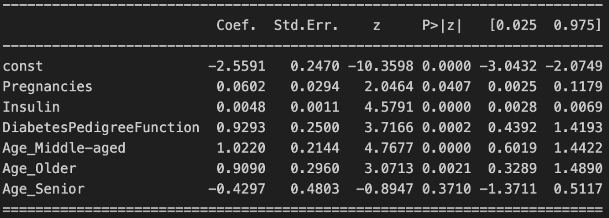
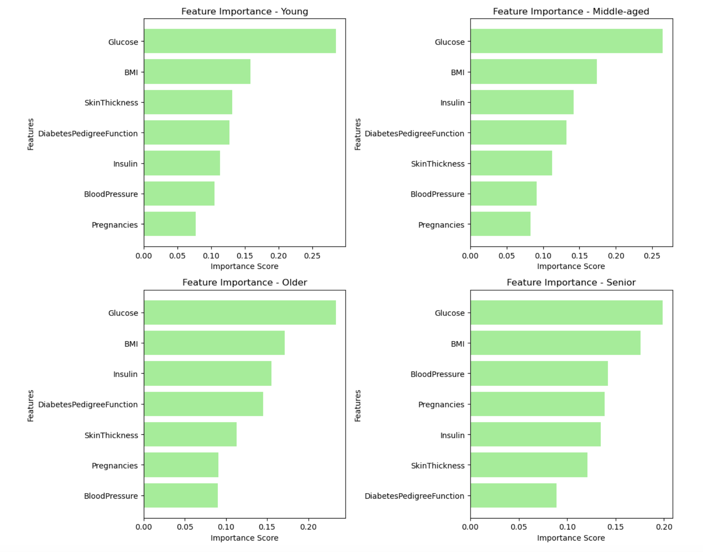

# Diabetes Analysis Using Machine Learning Models

## Project description
This project uses the Pima Indians Diabetes Database and it aims to predict type 2 diabetes
based on health metrics, including glucose, BMI, blood pressure, insulin, age, pregnancies, skin
thickness, and diabetes pedigree function (genetic risk score). Furthermore, it helps to predict
key risk factors of different age groups and see the impact of age factor in diabetes.

## Modeling Approach
* Logistic regression: logistic regression provides clear odds ratios, which can explain
  diabetes risk factors for better interpretability

* Random forest: random forest can solve the problem of multicollinearity and it is used for
  better predictive accuracy

## Key Insights

### Initial VIF Values

| Feature                     | VIF      |
|-----------------------------|---------:|
| Pregnancies                 | 3.682    |
| Glucose                     | 20.865   |
| BloodPressure               | 27.784   |
| SkinThickness               | 17.815   |
| Insulin                     | 5.842    |
| BMI                         | 34.916   |
| DiabetesPedigreeFunction    | 3.192    |
| Age_Middle-aged             | 2.285    |
| Age_Older                   | 1.797    |
| Age_Senior                  | 1.256    |

#### **Dropped Features Due to High VIF**
- **BMI** (VIF: 34.92)
- **BloodPressure** (VIF: 20.71)
- **Glucose** (VIF: 13.48)
- **SkinThickness** (VIF: 5.85)

####  **Final Features After Dropping High VIF Terms**
`['Pregnancies', 'Insulin', 'DiabetesPedigreeFunction', 'Age_Middle-aged', 'Age_Older', 'Age_Senior']`

### Regression Coefficients

### Feature Importance of Different Age Groups (From Random Forest ML Model)

### Model Evaluation Point Metric
| Logistic Regression | Random Forest |
|---------|---------|
|  |  |

### Model Evaluation AUCPRC
| Logistic Regression | Random Forest |
|---------|---------|
|  |  |

### Insights
Glucose was the strongest predictor, signaling impaired sugar metabolism, with BMI, insulin
levels, and DPF also playing key roles, however, they might be related to other factors as they
show high correlation with other factors. Age increased diabetes risk, especially after 35, but
risk factors varied by age. Young adults (18-30) had stronger associations with Skin Thickness,
middle-aged (31-45) with insulin resistance, older adults (46-60) with BMI, and seniors (61+)
with Blood Pressure, linking diabetes to cardiovascular health. These findings emphasize the
need for age-specific screening, prevention strategies, and targeted diabetes management.

## Practical Implications
These findings support targeted screening and prevention. Age-based screening improves
detection in middle-aged and older adults, reducing diabetes progression and costs. Plus,
diabetes solutions can be customized in different age groups as well. Predictive modeling
enhances risk assessment, resource allocation, and data-driven decision-making, optimizing
chronic disease management and patient outcomes.
